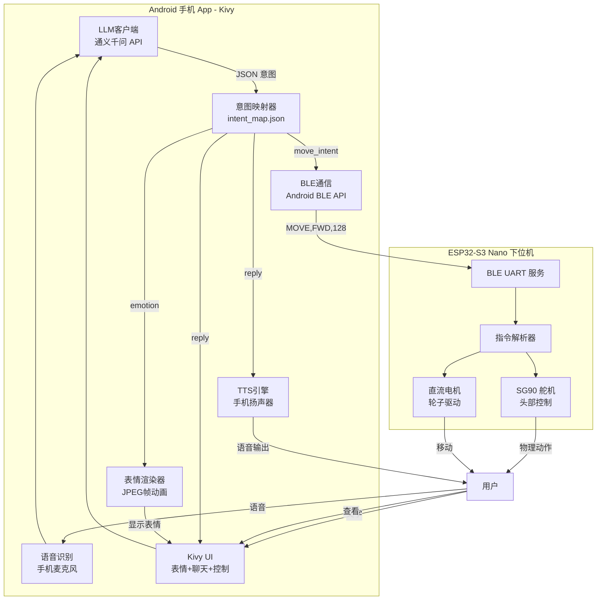

# 🐱 桌面猫手机App - 架构说明

## 一、系统架构总览



## 二、核心流程 (LLM→意图→动作)

### 2.1 LLM 输出格式

System Prompt 约束大模型输出 JSON：

```json
{
    "reply": "很高兴见到你！",
    "emotion": "happy",
    "move_intent": "slow_forward"
}
```

| 字段 | 类型 | 可选值 |
|------|------|-------|
| `reply` | string | 对话回复文本 |
| `emotion` | string | happy, sad, angry, surprised, thinking, sleepy, excited, confused, love, fear, shy, neutral |
| `move_intent` | string | none, slow_forward, slow_backward, turn_left, turn_right, stop |

### 2.2 本地映射表 (intent_map.json)

**不消耗 token，完全离线运行：**

```
slow_forward  → MOVE,FWD,128    → BLE下发
happy         → anim6/          → 手机渲染表情
happy         → SERVO:1,45      → BLE下发舵机动作
```

### 2.3 并行执行

手机端收到 LLM 返回后：

1. **emotion → 动画表** → 加载本地 JPEG 帧 → 手机屏幕渲染
2. **emotion → 舵机角度表** → BLE 下发舵机指令
3. **move_intent → BLE指令表** → BLE 下发运动指令
4. **reply → TTS引擎** → 手机扬声器播放

## 三、硬件连接

### ESP32-S3 Nano 引脚分配

| 功能 | 引脚 | 说明 |
|------|------|------|
| SERVO1 (Yaw) | GPIO4 | 头部左右，SG90 |
| SERVO2 (Pitch) | GPIO5 | 头部上下，SG90 |
| 左轮 IN1 | GPIO6 | TB6612FNG |
| 左轮 IN2 | GPIO7 | TB6612FNG |
| 左轮 PWM | GPIO8 | TB6612FNG |
| 右轮 IN3 | GPIO15 | TB6612FNG |
| 右轮 IN4 | GPIO16 | TB6612FNG |
| 右轮 PWM | GPIO17 | TB6612FNG |
| LED | GPIO21 | 板载LED |

## 四、与原方案差异对比

| 维度 | 原方案 (ESP32-S3 Sense) | 新方案 (手机App) |
|------|------------------------|-----------------|
| 屏幕 | 微雪1.83寸 (170×320) | **手机屏幕** (全彩高清) |
| 音频输出 | MAX98357A + 扬声器 | **手机扬声器** |
| 音频输入 | I2S 麦克风 | **手机麦克风** |
| 摄像头 | OV2640 | **手机摄像头** (可选) |
| 表情存储 | ESP32 Flash (JPEG帧) | **手机本地存储** |
| 舵机 | 4×STS3032 + PCA9685 | **2×SG90** (仅头部) |
| 运动 | 四足步态 | **2×直流电机轮子** |
| 通信 | WiFi WebSocket | **BLE 5.0** |
| LLM API | 云端 | **云端** (手机直连) |
| TTS | 边缘TTS→ESP32播放 | **手机TTS** |
| 处理能力 | ESP32-S3受限 | **手机高性能** |
